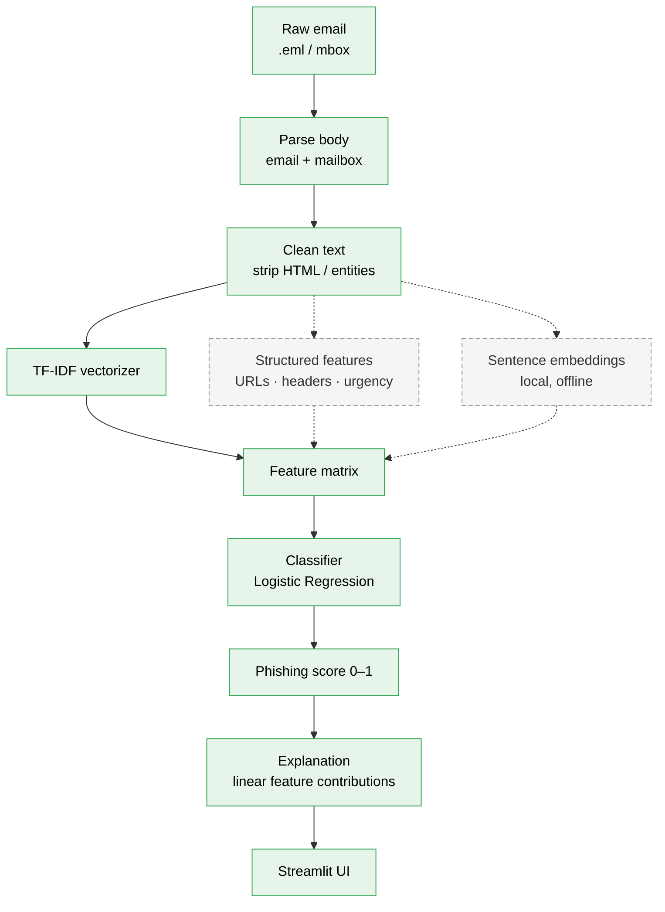

# Phishing Email Detector

A machine-learning classifier that flags phishing emails, taking raw email
through parsing, cleaning, and feature extraction to an explainable model. Runs
fully offline — Python + scikit-learn, with a Streamlit UI that scores an email
and highlights the words that drove the decision.

## Demo


*Paste an email (or upload a `.eml`) → phishing score → the exact words that drove
it, highlighted warm (phishing) or cool (legitimate) in the text.*

## Projected architecture

The end-to-end pipeline. Solid boxes are implemented; dashed boxes are planned
(Phase 2 / Phase 3).



## Dataset

Two public corpora, framed as **phishing vs. legitimate** (not spam vs. ham):

| Class | Source | Count |
|-------|--------|------:|
| Legitimate (0) | Enron corpus (enron1/3/5, *ham* only) | 9,184 |
| Phishing (1)   | Nazario phishing corpus (2015–2025)    | 3,013 |

Generic spam is deliberately excluded — the target is *phishing* specifically,
not all unwanted mail. Raw datasets are gitignored; see [Setup](#setup) to
reproduce.

## Results

### Phase 1 — TF-IDF + Logistic Regression baseline

| Model | Accuracy | Phishing recall | Phishing precision |
|-------|:--------:|:---------------:|:------------------:|
| TF-IDF + LogReg            | 0.989 | 0.96 | 1.00 |
| + HTML cleaning            | 0.986 | 0.95 | 0.99 |

Evaluated on a stratified 20% hold-out set (2,440 emails).

### Honest limitations (error analysis)

Inspecting the model's highest-weighted features reveals that the headline
accuracy is **partly inflated by dataset artifacts**, not pure phishing
semantics:

- **Source confound.** The strongest "legitimate" signals are Enron-specific
  terms (`enron`, `ect`, `hpl`, `713`, `energy`, `meter`). Because the entire
  legitimate class is Enron mail, the model can shortcut to *"is this an Enron
  email?"* rather than *"is this legitimate?"*. This is baked into the data and
  cannot be removed by preprocessing.
- **Formatting artifact (fixed).** The original model leaned on HTML/CSS tokens
  (`nbsp`, `0px`, `style`, `font`) — phishing mail is HTML-heavy, Enron mail is
  plain text. Stripping HTML removed this cheat with a negligible accuracy cost
  (0.989 → 0.986), and the top phishing features became genuinely semantic
  (`account`, `verify`, `click`, `kindly`, `payment`).

These findings motivate Phase 2: features that signal phishing **regardless of
source**.

### Phase 2 — Cross-source generalization test

To measure how much the source confound actually costs, the Phase 1 model was
evaluated on a **held-out, non-Enron legitimate corpus** it never trained on
(SpamAssassin `easy_ham`, 2,551 messages, all legitimate). Because every email
is truly legit, any "phishing" prediction is a false positive.

| Test set (legitimate email) | Emails | False positives | FP rate |
|-----------------------------|-------:|----------------:|:-------:|
| In-distribution (Enron)     | 1,837  | 3               | 0.16%   |
| Out-of-distribution (SpamAssassin) | 2,551 | 58       | **2.3%** |

The false-positive rate rises **~14×** on an unseen source — the confound is
real and quantified. But the model still classifies **97.7%** of unseen
legitimate email correctly, so it also learned genuinely generalizable phishing
language, not *only* Enron cues. The confound is a thumb on the scale, not the
whole story.

**Error analysis of the 58 false positives:** 55 of 58 contain links, and the
worst offenders are legitimate mailing-list newsletters (e.g. *"use Perl Daily
Newsletter"*) using transactional vocabulary (`account`, `download`,
`security`). The model conflates *"links + transactional words"* with phishing.

### Phase 2 — Out-of-distribution phishing recall

The flattering in-distribution recall (0.95) hides a second problem. Evaluated on
a **different phishing source** it never trained on (`phishing_pot`, 7,157
messages with usable bodies, all phishing), recall collapses:

| Phishing test set | Emails | Caught | Recall |
|-------------------|-------:|-------:|:------:|
| In-distribution (Nazario hold-out) | 603 | 572 | 0.95 |
| Out-of-distribution (phishing_pot) | 7,157 | 4,121 | **0.58** |

The model misses **42% of real phishing** from an unseen source. The 0.95 was
largely memorizing Nazario's (mostly English) vocabulary; phishing in other
languages or phrasings sails through. This is where **source-independent
structured features** — which don't depend on specific words — have room to help.

### Phase 2 — Structured features: the precision/recall tradeoff

Adding structured features (`num_ip_urls`, `num_links`) computed from raw text
(before HTML cleaning, so `href` URLs survive), scaled with `StandardScaler`
fit on training data only, then stacked onto the TF-IDF matrix:

| Model | In-dist accuracy | OOD phishing recall | OOD legit FP rate |
|-------|:----------------:|:-------------------:|:-----------------:|
| TF-IDF baseline            | 0.986 | 0.576 | 0.023 |
| + structured (unscaled)    | 0.985 | 0.776 | 0.800 |
| + structured (**scaled**)  | 0.986 | 0.775 | **0.611** |

Findings:
- Structured features **lift OOD phishing recall ~20 points** (0.58 → 0.78) —
  they genuinely catch phishing the word model misses.
- But they **wreck precision on link-heavy legitimate mail**: the OOD false-
  positive rate explodes from 2.3% to 61–80%.
- **Feature scaling matters.** Unscaled, the raw count (`num_links` can be 30+)
  dominates the ~0–1 TF-IDF values by sheer magnitude; scaling cut the FP rate
  from 0.80 to 0.61. But it only fixed the *mechanical* problem, not the root one.
- **Raw counts are too blunt.** "How many links" cannot separate a legitimate
  newsletter from a phishing blast — both are link-heavy. The signal that would
  is *qualitative* (is a link suspicious — bad TLD, IP literal, sender/domain
  mismatch), not *quantitative*.
- **In-distribution accuracy hid all of this** (0.986 either way). Only the
  cross-source evaluation exposed the tradeoff — the strongest argument in this
  project for why out-of-distribution testing is essential.

### Phase 2 — Qualitative vs quantitative features (the ceiling)

If raw *counts* are too blunt, does a *qualitative* signal — links to known-abused
TLDs (`.xyz`, `.tk`, `.top`, …) — do better? Fire rates on the OOD sets:

| Feature | Fires on OOD legit | Fires on OOD phishing |
|---------|:------------------:|:---------------------:|
| `num_links` (quantitative) | 80.0% | 75.4% |
| `suspicious_tld_links` (qualitative) | 0.2% | 2.2% |

`suspicious_tld_links` is **clean but rare** — it fires ~10× more on phishing than
legit (good precision, almost no false alarms), but only 2.2% of phishing uses a
suspicious TLD (modern phishing prefers compromised legit domains, shorteners, and
`.com` lookalikes). So it barely moves aggregate recall.

**The core finding of the feature-engineering work:** *common features are
ambiguous; unambiguous features are rare.* No surface-level URL feature is both
frequent and discriminating — `num_links` (common/ambiguous), `suspicious_tld_links`
and `num_ip_urls` (rare/clean) bracket the tradeoff. This is a property of the
problem, not the implementation, and it motivates two different directions:
**diversifying the training data** and **semantic representations (embeddings)**
that generalize across wording rather than matching surface patterns.

### Phase 2 — Resolution: diverse data beats clever features

Rather than engineer more features, the model was retrained on **all four sources
pooled** (Enron + Nazario + SpamAssassin + phishing_pot), splitting *each source*
80/20 (stratified by source) so every source appears in both train and test.
TF-IDF only — no structured features.

| Test source | Metric | Narrow training | Diverse training |
|-------------|--------|:---------------:|:----------------:|
| phishing_pot | recall  | 0.58 | **0.99** |
| spamassassin | FP rate | 0.023–0.61 | **0.002** |
| nazario      | recall  | 0.95 | 0.99 |
| enron        | FP rate | 0.002 | 0.005 |

Simply adding diverse training data lifted phishing_pot recall **0.58 → 0.99**
while *dropping* false positives — no tradeoff, both metrics improved. This dwarfs
the best structured-feature result (+20 recall at the cost of 60%+ false
positives). **The takeaway: the earlier failure was a data-coverage gap, not a
model limitation — diverse data beats clever features.**

**Caveats (kept deliberately honest):**
- This is an *easier* test than the 0.58 baseline: phishing_pot is now partly in
  training, so this measures "generalize to new emails of a *known* style," not
  "generalize to a *never-seen* source." The two numbers are not apples-to-apples;
  the point is that the failure was a coverage gap.
- phishing_pot is campaign-collected and may contain near-duplicate messages; if
  near-dupes straddle train/test, recall is inflated by memorization (a dedup pass
  is future work).
- With all four sources now in training, true novel-source generalization can no
  longer be measured without a fifth corpus.

## Roadmap

- [x] **Phase 1 — Baseline.** TF-IDF + Logistic Regression, stratified eval,
      feature-weight inspection, HTML-cleaning experiment.
- [x] **Phase 2 — Generalization & structured features.**
      Cross-source generalization tests (confound quantified — OOD legit FP 2.3%,
      OOD phishing recall collapses 0.95 → 0.58), error analysis, a
      structured-features experiment (`num_ip_urls`, `num_links`,
      `suspicious_tld_links` with scaling) establishing that surface features hit a
      ceiling, and the resolution: diverse training data lifts phishing_pot recall
      0.58 → 0.99 with no precision cost. Optional follow-up: local sentence
      embeddings vs. TF-IDF.
- [~] **Phase 3 — UI + explainability.** Streamlit app (paste/upload an email →
      phishing score + per-word contributions from the linear model) — done.
      Remaining: demo GIF, optional deployment.

## Setup

```bash
python -m venv venv
source venv/bin/activate        # Windows: venv\Scripts\activate
pip install -r requirements.txt
```

Place datasets under `data/` (gitignored):

```
data/
├── enron1/  enron3/  enron5/   # training legit — each with ham/ subdir
├── nazario/                    # training phishing — phishing-YYYY mbox files
├── easy_ham/                   # OOD test: SpamAssassin legit (non-Enron)
└── phishing-email/             # OOD test: phishing_pot .eml (non-Nazario)
```

The two OOD sets are held-out test data only — never used for training.

## Usage

```bash
python -m src.train             # run both generalization experiments, print metrics
python -m src.train_model       # train the production model, save to models/
streamlit run app/app.py        # launch the web UI (needs models/ from the step above)
```

The app takes a pasted email or an uploaded `.eml`, returns a phishing score, and
shows the words that drove it (exact per-word contributions from the linear model).

## Project structure

```
src/
├── parse.py         # extract body text from email.message / mbox / .eml
├── load_data.py     # build labeled DataFrames from every corpus
├── preprocess.py    # HTML cleaning
├── features.py      # structured features (URL/TLD counts)
├── train.py         # experiments: split → TF-IDF (+structured) → LogReg → evaluate
└── train_model.py   # train production model on all sources → models/
app/
└── app.py           # Streamlit UI: email → phishing score + word contributions
tests/
├── test_parse.py
└── test_features.py
```
