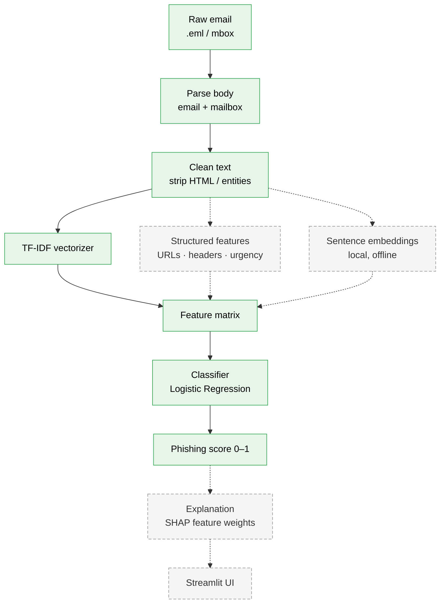

# Phishing Email Detector

A machine-learning classifier that flags phishing emails, taking raw email
through parsing, cleaning, and feature extraction to an explainable model. Runs
fully offline — Python + scikit-learn, with a planned minimal Streamlit UI.

## Projected architecture

The end-to-end pipeline. Solid boxes are implemented; dashed boxes are planned
(Phase 2 / Phase 3).



## Dataset

Two public corpora, framed as **phishing vs. legitimate** (not spam vs. ham):

| Class | Source | Count |
|-------|--------|------:|
| Legitimate (0) | Enron corpus (enron1/3/5, *ham* only) | 9,184 |
| Phishing (1)   | Nazario phishing corpus (2015–2025)    | 3,013 |

Generic spam is deliberately excluded — the target is *phishing* specifically,
not all unwanted mail. Raw datasets are gitignored; see [Setup](#setup) to
reproduce.

## Results

### Phase 1 — TF-IDF + Logistic Regression baseline

| Model | Accuracy | Phishing recall | Phishing precision |
|-------|:--------:|:---------------:|:------------------:|
| TF-IDF + LogReg            | 0.989 | 0.96 | 1.00 |
| + HTML cleaning            | 0.986 | 0.95 | 0.99 |

Evaluated on a stratified 20% hold-out set (2,440 emails).

### Honest limitations (error analysis)

Inspecting the model's highest-weighted features reveals that the headline
accuracy is **partly inflated by dataset artifacts**, not pure phishing
semantics:

- **Source confound.** The strongest "legitimate" signals are Enron-specific
  terms (`enron`, `ect`, `hpl`, `713`, `energy`, `meter`). Because the entire
  legitimate class is Enron mail, the model can shortcut to *"is this an Enron
  email?"* rather than *"is this legitimate?"*. This is baked into the data and
  cannot be removed by preprocessing.
- **Formatting artifact (fixed).** The original model leaned on HTML/CSS tokens
  (`nbsp`, `0px`, `style`, `font`) — phishing mail is HTML-heavy, Enron mail is
  plain text. Stripping HTML removed this cheat with a negligible accuracy cost
  (0.989 → 0.986), and the top phishing features became genuinely semantic
  (`account`, `verify`, `click`, `kindly`, `payment`).

These findings motivate Phase 2: features that signal phishing **regardless of
source**.

## Roadmap

- [x] **Phase 1 — Baseline.** TF-IDF + Logistic Regression, stratified eval,
      feature-weight inspection, HTML-cleaning experiment.
- [ ] **Phase 2 — Structured features.** URL analysis (IP-literal links,
      suspicious TLDs, URL length/entropy), sender-header anomalies, urgency
      language scoring; compare against baseline. Explore local sentence
      embeddings vs. TF-IDF.
- [ ] **Phase 3 — UI + explainability.** Streamlit app (paste/upload an email →
      phishing score + top contributing features via SHAP); demo GIF.

## Setup

```bash
python -m venv venv
source venv/bin/activate        # Windows: venv\Scripts\activate
pip install -r requirements.txt
```

Place datasets under `data/` (gitignored):

```
data/
├── enron1/  enron3/  enron5/   # each with ham/ subdir
└── nazario/                    # phishing-YYYY mbox files
```

## Usage

```bash
python -m src.train             # load, clean, train, evaluate, print metrics
```

## Project structure

```
src/
├── parse.py        # extract body text from email.message / mbox
├── load_data.py    # build labeled DataFrame from both corpora
├── preprocess.py   # HTML cleaning
└── train.py        # split → TF-IDF → LogReg → evaluate
tests/
└── test_parse.py
```
